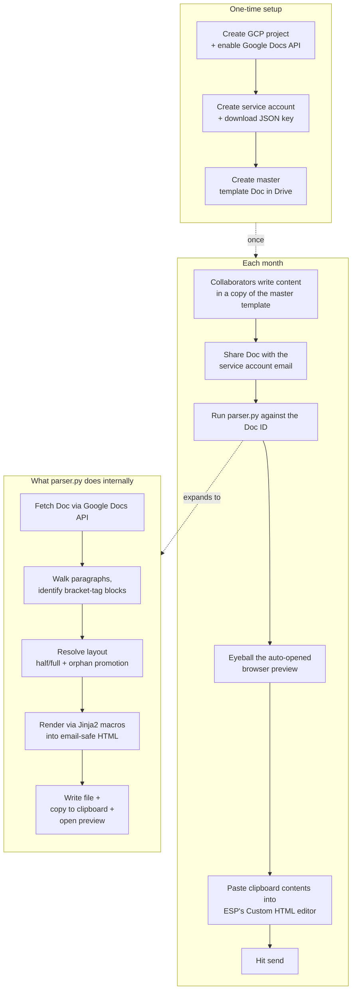
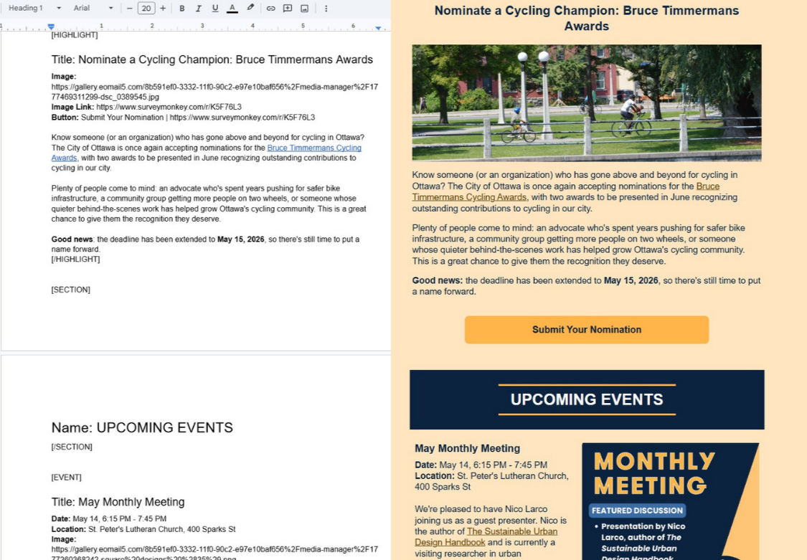

# gdoc-to-newsletter-html

A Python pipeline that turns a Google Doc into an email-safe HTML newsletter, ready to paste into your email service provider (ESP).

Built for the [Strong Towns Ottawa](https://strongtownsottawa.ca/) monthly newsletter, but the design is generic enough to adapt for any organization that:

- writes newsletters collaboratively in Google Docs,
- sends through an ESP (EmailOctopus, Mailchimp, Beehiiv, etc.) that has a "Custom HTML" or "paste HTML" editor,
- doesn't want collaborators to learn HTML or fight with rich-text editors.

Collaborators write content using a simple bracket-tag convention (`[HIGHLIGHT]`, `[EVENT]`, `[NEWS]`, etc.). The parser reads the Doc via Google's API, applies layout rules (half-column vs. full-width, auto-paired event blocks, button-count detection), and renders into a hand-crafted email-safe HTML template.

## How it works



## What you get



Open [`examples/may-2026-rendered.html`](examples/may-2026-rendered.html) in your browser to see real output — the May 2026 Strong Towns Ottawa newsletter rendered by this pipeline.

## Quick start

### Try the example without setup

Open [`examples/may-2026-rendered.html`](examples/may-2026-rendered.html) in your browser. That's the full output from running the parser against [`examples/may-2026-example.txt`](examples/may-2026-example.txt) (pasted into a Google Doc with proper formatting).

### Run the parser yourself

1. **Clone and install:**
   ```bash
   git clone https://github.com/YOUR-USERNAME/gdoc-to-newsletter-html.git
   cd gdoc-to-newsletter-html
   python -m pip install -r requirements.txt
   ```

2. **Set up Google Cloud auth** (one-time): follow [`docs/google-doc-setup.md`](docs/google-doc-setup.md). You'll end up with a service account JSON key and a Doc shared with the service account's email.

3. **Get a Doc to parse.** Either:
   - **Master template (blank):** [click here to copy it to your Drive](https://docs.google.com/document/d/1hkdR-f7m8gfsSBGPvon6etNiEmhJiww8s8Eq_JOaMYU/copy)
   - **Filled May 2026 example:** [click here to copy it to your Drive](https://docs.google.com/document/d/1oLFY4HDMMO4-xOY2UJVgFOhVjV2pQeS-B6ZfnjL1iQo/copy)

   Both are also available as `.docx` exports in [`examples/`](examples/) — upload to your own Drive if the share links don't work.

4. **Run:**
   ```bash
   python parser.py \
     --doc-id <YOUR_DOC_ID> \
     --credentials path/to/service-account.json \
     --output newsletter.html \
     --copy-to-clipboard \
     --open-preview
   ```

   Output: a `newsletter.html` file written to disk, copied to your clipboard, and auto-opened in your browser.

5. **Paste into your ESP's "Custom HTML" editor** (Ctrl+V), eyeball, send.

## Writing newsletters in the Doc

See [`docs/convention.md`](docs/convention.md) for the full bracket-tag reference. Quick map:

| Tag | Use |
|---|---|
| `[META]` | Newsletter title + preheader text |
| `[SECTION]` | Navy section banner (e.g. "OUR HIGHLIGHTS") |
| `[LEAD]` | Italic intro paragraph |
| `[HIGHLIGHT]` | Full-width story (image + body + N buttons) |
| `[SPOTLIGHT]` | Community group spotlight (same shape as HIGHLIGHT) |
| `[EVENT]` | Upcoming event (50/50 layout, auto-pairs adjacent events) |
| `[RECAP]` | Event recap (50/50 by default, `Layout: full` overrides) |
| `[NEWS]` | Bulleted news list |
| `[CITY-HALL]` | Committee/council meeting list |
| `[IMAGE-ONLY]` | Standalone centered image |

Each block has `[OPENING]` and `[/CLOSING]` tags with `Key: value` fields inside. Example:

```
[EVENT]
Title: May Monthly Meeting
Date: May 14, 6:15 PM - 7:45 PM
Location: St. Peter's Lutheran Church, 400 Sparks St
Image: https://your-image-host.com/event.jpg
Button: RSVP | https://luma.com/abc123

Free-form description goes here in the body.
[/EVENT]
```

## Customizing for your organization

Three things you'll want to change:

1. **Brand styling** in [`templates/newsletter.html.j2`](templates/newsletter.html.j2): colors, logo URL, social icon links, fonts. Search for these palette values:
   - `#ffe6c1` — cream background
   - `#0c2340` — dark navy (section banners, body text)
   - `rgb(255,181,73)` — yellow accent (buttons, dividers)
   - `#623a00` — link color
2. **ESP merge tags** in the footer: the template uses EmailOctopus's `{{UnsubscribeURL}}`, `{{SenderInfo}}`, `{{WebVersionURL}}`, `{{RewardsURL}}`. Swap for your ESP's equivalents.
3. **Block types**: add new types in `BLOCK_LAYOUT_DEFAULTS` (in `parser.py`) and define matching macros in `newsletter.html.j2`.

## Why the pipeline stops at HTML (instead of auto-creating a campaign)

EmailOctopus's API only supports reading campaigns, not creating them. See [`docs/emailoctopus-limitation.md`](docs/emailoctopus-limitation.md) for the investigation and why the manual paste step is acceptable. Other ESPs (Mailchimp, Beehiiv, ConvertKit) have full campaign-creation APIs if you want to fork and extend.

## License

[MIT](LICENSE).
